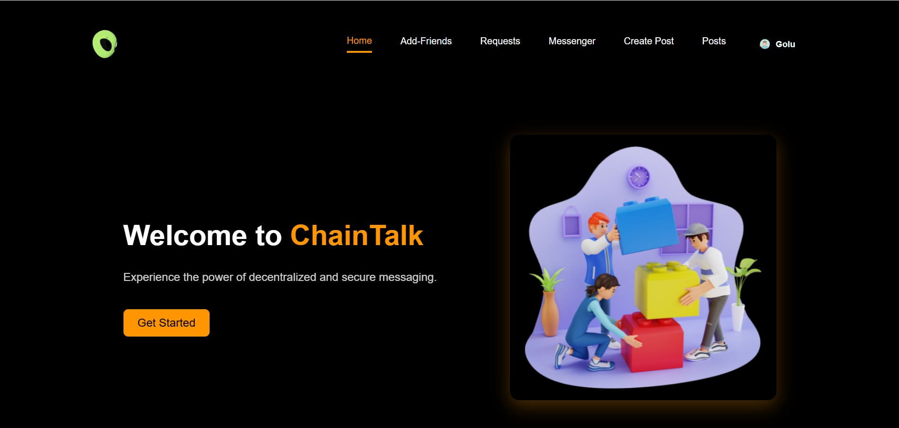
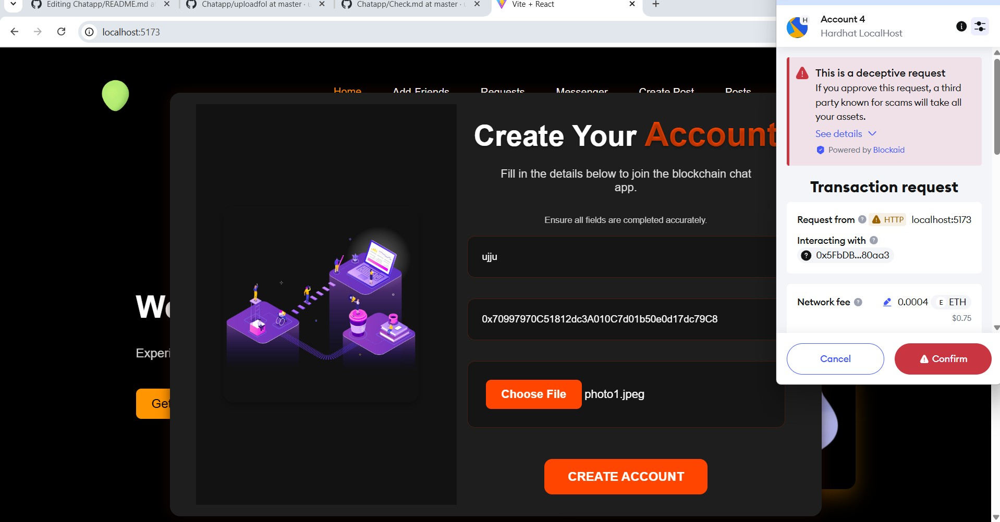
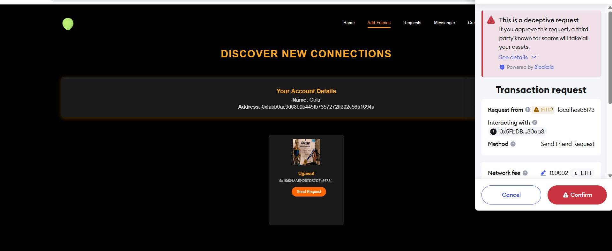
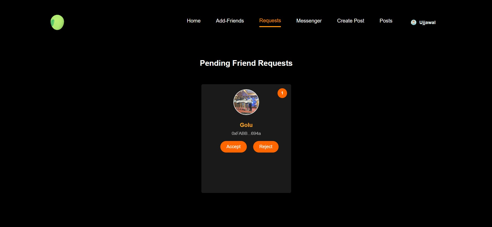
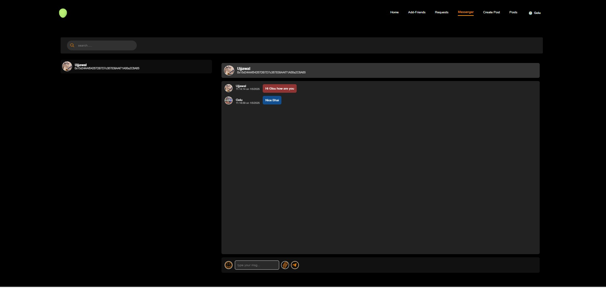
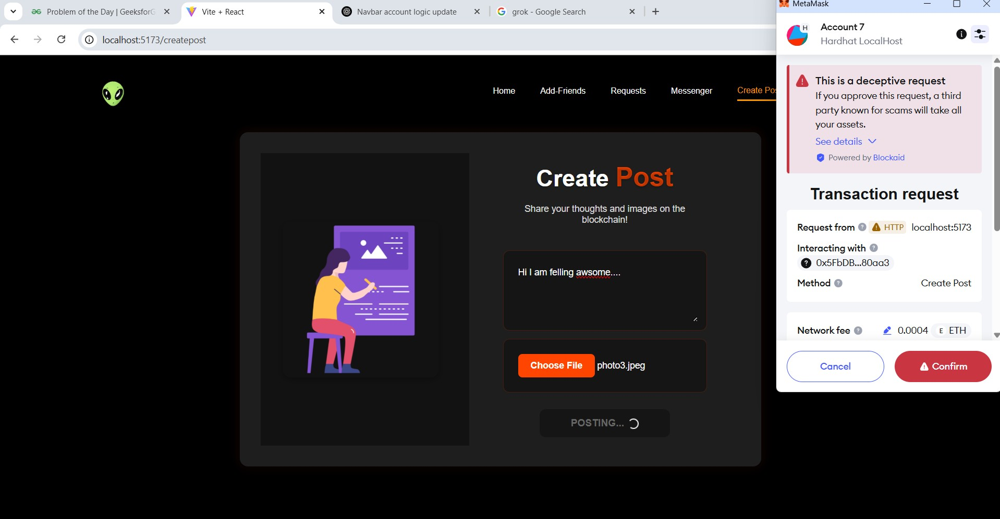
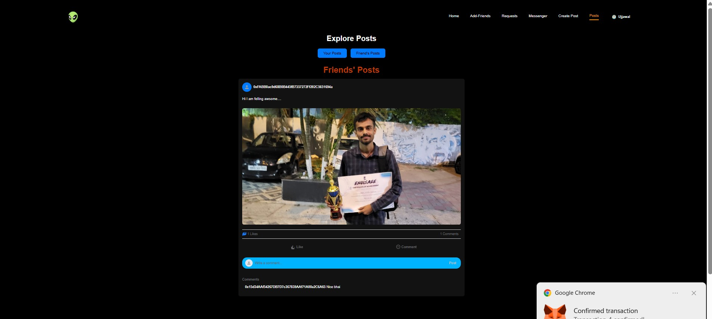

🔗 ChatApp – A Decentralized Social Networking Platform

ChatApp is a cutting-edge decentralized social media platform designed to empower users to connect, communicate, and share content without relying on centralized servers. Built on the robust foundation of blockchain technology, this platform ensures unparalleled data transparency, user ownership, and top-tier security. By leveraging the power of decentralized networks, ChatApp offers a revolutionary approach to social networking, where users maintain control over their data and interactions. This platform stands out by eliminating intermediaries, providing a secure and private environment for users to engage with one another.

🚀 Key Features
👛 Wallet-Based Account Creation
Sign up instantly using your Ethereum wallet, such as MetaMask, making the process quick and seamless.
Forget the hassle of passwords—your wallet serves as your unique identity, simplifying access while enhancing security.
This feature leverages blockchain authentication, ensuring that your account is tied to your cryptographic wallet address, offering a secure and password-less experience.

🌐 Social Networking
Discover and connect with other blockchain users effortlessly, expanding your network across the decentralized ecosystem.
Send and accept friend requests seamlessly, fostering meaningful connections with like-minded individuals.
Build a trusted peer-to-peer connection network, where interactions are direct and free from third-party interference, enhancing trust and reliability.

💬 Decentralized Real-Time Chat
Chat privately with friends without a server in the middle, ensuring end-to-end encryption and privacy.
Enjoy a fully interactive and privacy-focused chat experience, where your conversations remain confidential and secure.
This feature utilizes blockchain to timestamp and verify messages, adding an additional layer of integrity to your communications.

📸 Post, Like & Interact
Share your thoughts via posts, which are visible only to your friends, maintaining your privacy within your chosen network.
Like posts to engage with your community—every action is backed by smart contracts, ensuring transparency and immutability.
This interactive feature allows users to express themselves freely while the blockchain records all actions, creating a verifiable history of engagement.

🛠️ Tech Stack
🌐 Frontend
⚛️ React.js – A powerful JavaScript library that enables the creation of a responsive and dynamic user interface, ensuring a smooth and engaging user experience across devices.

🔌 Ethers.js – A comprehensive library that facilitates seamless communication with the blockchain, allowing for efficient interaction with Ethereum-based smart contracts.

🦊 Web3Modal + MetaMask – An integration solution that connects your Ethereum wallet (e.g., MetaMask) to the application, providing a user-friendly wallet management system and secure transaction signing.

🔗 Blockchain

🧠 Solidity – A robust programming language used to write smart contracts, handling user accounts, posts, and messaging logic with precision and security.

🔨 Hardhat – A development environment tailored for Ethereum, offering tools for compiling, testing, and deploying smart contracts efficiently.

🌍 Ethereum / Polygon – Flexible deployment options on the Ethereum mainnet or the Polygon network, providing scalability and cost-effective transaction processing.

📦 Installation

Step-by-Step Installation Guide.

To get started with ChatApp, follow these detailed steps to set up the project on your local machine:

Clone the Repository:-

git clone https://github.com/ujjawal-mukherjee/Chatapp.git

cd Chatapp

This command downloads the entire ChatApp repository to your local environment and navigates into the project directory.

Set Up the Frontend

cd frontend

npm install

Navigate to the frontend directory and install all necessary Node.js dependencies required for the React application.

Set Up the Smart Contract

cd blockchain

npm install

Move to the blockchain directory and install the dependencies needed for smart contract development and deployment.

Compile and Deploy Smart Contracts

npx hardhat compile

npx hardhat run scripts/deploy.js --network localhost

Compile the Solidity smart contracts using Hardhat, then deploy them to a local Ethereum network for testing purposes.

Start the Frontend Application

cd frontend

npm start
Return to the frontend directory and launch the application, which will run on http://localhost:3000 by default.
